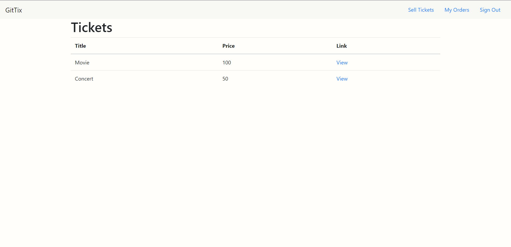

# [Stephen Grider] Microservices with Node JS and React

## Build, deploy, and scale an E-Commerce app using Microservices built with Node, React, Docker and Kubernetes

 

 

## How to run apps

I am working in Windows.

Kubectl, Docker, Skaffold must be installed.

 

## How to run the final app

 

First, you must be log in to docker

    $ docker login

Need to update my docker image name rochmad7/* to your in scripts from skaffold and k8s folders. Then build each project
using docker.

    $ docker build -t rochmad7/auth .
    $ docker push rochmad7/auth

Then run skaffold.

    $ skaffold dev

 

    $ kubectl get pods
    NAME                                     READY   STATUS    RESTARTS   AGE
    auth-depl-f9d994bcc-qcz9w                1/1     Running   0          7m21s
    auth-mongo-depl-7c9d9cbf7c-fg7rb         1/1     Running   0          7m21s
    client-depl-64c59b7f-8zlnh               1/1     Running   0          7m21s
    expiration-depl-6fb48464dd-mz5ns         1/1     Running   0          7m21s
    expiration-redis-depl-7bcf8c7c54-69pt8   1/1     Running   0          7m20s
    nats-depl-576dff96c5-bb9vq               1/1     Running   0          7m20s
    orders-depl-6f466645b5-7lhhx             1/1     Running   0          7m20s
    orders-mongo-depl-7fb5f64cf-j7bk6        1/1     Running   0          7m20s
    payments-depl-c8c4b69-wz7s6              1/1     Running   0          7m19s
    payments-mongo-depl-58fd75864c-hxnrk     1/1     Running   0          7m19s
    tickets-depl-df85c8f69-qcr78             1/1     Running   0          7m19s
    tickets-mongo-depl-6546d4c44f-4r54t      1/1     Running   0          7m19s

 

Open client side using chrome browser --> https://ticketing.dev/

 

type: **thisisunsafe** in the browser window with security warning.

 

Expected result:

 